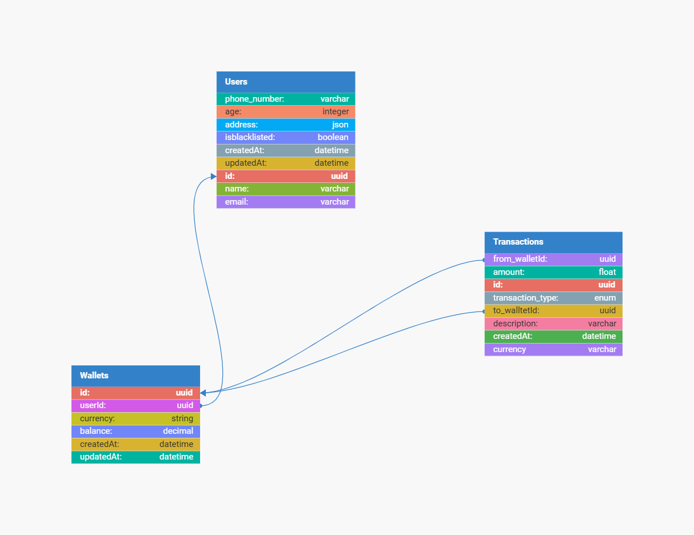

# Demo Credit Financial App

Demo Credit is a mobile lending app that requires wallet functionality allowing users to create accounts, fund them, transfer funds between accounts, and withdraw funds. This README provides a comprehensive overview of the project, including the E-R Diagram, setup instructions, implementation details, and the technologies used.

# E-R Diagram



The E-R Diagram represents the relationships between the main entities in the Demo Credit financial app: User, Wallet, and Transaction.
It shows how each entities are connected, ensuring data integrity and efficient handling of user and transaction data [DB Designer](https://erd.dbdesigner.net/designer/schema/1719599003-demo-credit).

## Entities and Relationships

- User

  - Attributes: UserID (Primary Key), Name, Email, Password, isBlacklisted
  - Relationships: A user can have one or more wallets.

- Wallet

  - Attributes: WalletID (Primary Key), UserID (Foreign Key), Balance
  - Relationships: A wallet belongs to a user and can have multiple transactions.

- Transaction
  - Attributes: TransactionID (Primary Key), WalletID (Foreign Key), Amount, TransactionType, TransactionDate
  - Relationships: A transaction belongs to a wallet.

## Technologies Used:

-- Node.js: Server-side JavaScript engine for building applications.
-- TypeScript: A Type-safe language that builds on JavaScript.
-- Knex: An SQL Query builder for database migration and queries used for user and transaction management.
-- MySQLDB: Relational Database Managemant System used for storing user and transaction data.
-- Yup: Validation library for ensuring data integrity and efficient handling of user and transaction data.

## Setup:

## Installation

1. Clone the repository: `git clone [repository]-url`
   - Open the terminal and run:
   ```
   git clone https://github.com/deolla/Demo-Credit
   ```
2. Install dependencies:
   - Navigate to the Demo-Credit directory:
   ```
   cd ~/Demo-Credit/ && npm install
   ```
3. Set up environment variables:
   - Create a `.env` file in the root directory.
   - Define environment variables such as database connection, secret, gmailemail etc.
   ```
   DB_NAME=your_db_name
   DB_USER=your_db_user
   DB_PASSWORD=your_db_password
   DB_HOST=127.0.0.1
   DB_PORT=3306
   NODE_ENV=environment
   etc.
   ```
4. Run database migrations:
   ```
   npm run knex migrate:latest
   ```

## Running Application

1. Start the Server:
   ```
   npm start
   ```
2. The application will be running at `http://localhost:3000`.

Implementations Details:
Project Structure

## Controllers

- User Controller: Contains CRUD implementations for Users.
- Wallet Controller: Contains CRUD implementations for wallets.
- Transaction Controller: Contains CRUD implementations for transactions.

## Models

- User Model: Represents the user entity and interactions with the user table.
- Wallet Model: Represents the wallet entity and interactions with the wallet table.
- Transaction Model: Represents the transaction entity and interactions with the transaction table.

## Routes

- User Routes: Define endpoints for user-related actions.
- Wallet Routes: Define endpoints for wallet-related actions.
- Transaction Routes: Define endpoints for transaction-related actions.

## Services

- User Service: Contains business logic for user operations.
- Wallet Service: Contains business logic for wallet operations.
- Transaction Service: Contains business logic for transaction operations.

## Services/Validations

Email Validation: Contains validations for email implementation.

# Contributing

Contributions are welcome! Please follow these steps:

Fork the repository.
Create a new branch: `git checkout -b feature/your-feature`.
Commit your changes: `git commit -m 'Add some feature'`.
Push to the branch: `git push origin feature/your-feature`.
Open a pull request.
